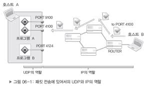

## UDP 에 대한 이해
UDP 소켓을 알아보자

## UDP 소켓의 특성
편지를 예로 들면서 UDP 의 동작원리를 설명해보자. 이는 UDP의 설명에 사용되는 전통적인 예로써 완벽히 UDP와 맞아 떨어진다. 편지를 보내기 위해서는 일단 편지봉투에다가 보내는 살마과 받는 살마의 주소정보를 적어놓는다. 그리고 우표를 붙여서 우체통에 넣어주면 끝이다. 다만 편지의 특성상 보내고 나서 상대방의 수신여부를 확인할 길은 없다. 문론 전송도중에 편지가 분실될 확률도 없지 않다. 즉, 편지는 신뢰할 수 없는 전송방법이다.

신뢰성만 놓고 보면 분명 TCP 가 UDP 보다 좋은 프로토콜이다. 하지만 UDP 는 TCP 보다 훨씬 간결한 구조로 설계되어있다. ACK 와 같은 응답 메시지를 보내는 일도 없으며, SSEQ와 같이 패킷에 번호를 부여하는 일도 없다. 때문에 상황에 따라서 TCP 보다 훨씬 좋은 성능을 발휘한다. 문론 프로그래밍의 관점에서 보더라도 UDP 는 TCP 보다 구현이 용이하다. 게다가 UDP도 TCP 만큼은 아니지만 생각만큼 데이터의 손실이 자주 발생하는 것은 아니기 때문에, 신뢴성보다 성능이 중요시 되는 상황에서는 UDP가 좋은 선택이다.

앞서 TCP 는 신뢴성 없는 IP 를 기반으로 신뢰성있는 데이터의 송수신을 위해서 '흐름제어(Flow Contorl)'을 한다고 설명했는데, 바로 이 흐름제어가 UDP에는 존재하지 않는다. 

"그럼 UDP 와 TCP의 차이는 흐름제어밖에 없는 건가요?"

그렇다 흐름제어가 UDP와 TCP를 구분지어주는 가장 큰 차이점이다. 그런데 TCP에서 흐름제어를 빼면 별로 남는게 없다. 다시 말해 TCP의 생명은 흐름제어에 있다.

## UDP 의 내부 동작원리
UDP 는 TCP와 달리 흐름제어를 하지 않는다고 앞서 설명하였다. 그럼 이번에는 UDP의 역할이 어디까지인지 구체적으로 언급해보자.



위 그림에서 보이듯이 호스트 B를 떠난 UDP 패킷이 호스트 A에게 전달되도록 하는 것은 IP의 역할이다. 그런데 이렇게 전달된 UDP 패킷을 호스트 A 내에 존재하는 UDP 소켓 중 하나에게 최종 전달하는 것은 IP의 역할이 아니다. 이는 바로 UDP 의 역할이다. 즉, UDP 의 역할 중 가장 중요한 것은 호스트로 수신된 패킷을 PORT 정보를 참조하여 최종 목적지인 UDP 소켓에 전달하는 것이다.

## Udp 의 효율적 사용 
네트워크 프로그래밍의 대부분이 TCP를 기반으로 구현될 것 같지만, UDP를 기반으로 구현되는 경우도 흔히 볼 수 있다. 그럼 언제 UDP를 사용하는 것이 효율적인까?

만약 1만개의 패킷을 보냈는데 그 중 1개만 손실되도 문제가 발생하는 압축파일의 경우에는 반드시 TCP를 기반으로 송수신이 이뤄져야 한다. 왜냐하면 압축파일은 특성상 파일의 일부만 손실되어도 압축의 해제가 어렵기 대문이다. 그러나 인터넷 기반으로 실시간 영상 및 음성을 전송하는 경우에는 얘개가 다르다. 멀티미디어 데이터는 그 특성상 일부가 손실되어도 크게 문제가 되지 않는다. 잠깐의 화면 떨림 또는 아주 작은 잡음 정도는 그냥 넘어갈만하다. 하지만 실시간 서비스를 해야하므로 속도가 상당히 중요한 요소가 된다. 이러한 경우가 UDP 기반의 구현을 고려할만한 상황이다.

그러나 UDP 가 TCP 에 비해서 언제나 빠른 속도를 내는 것은 아니다. TCP 가 UDP 에 비해 느린 이유 두 가지만 들라고 하면 다음 두 가지를 들 수 있다.

```
1. 데이터 송수신 이전, 이후에 거치는 연결설정 및 해제과정
2. 데이터 송수신 과정에서 거치는 신뢰성보장을 위한 흐름제어
```

따라서 송수신하는 데이터의 양 작으면서 잦은 연결이 필요한 경우에는 UDP가 TCP보다 훨씬 효율적이고 빠르게 동작한다. 


